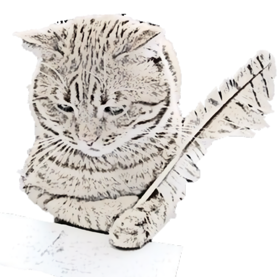

<h1 align = "center">
WritingHelper
</h1>

  Hope to make Writing English Fulently & naturally  🚀

  
  
  

Hi, I am a VS Code Extension of IELTS English Writing, which can provide professional suggestion and completion of `Word Collocation`/`Word Group`.
If you have not yet reliazed word collocation, you can see [here](https://www.thoughtco.com/what-is-collocation-1211244#:~:text=Collocation%20refers%20to%20a%20group%20of%20two%20or,place.%20Collocation%E2%80%8Bs%20are%20words%20that%20are%20located%20together.) for more information.

## 💡 演示

## 📝使用说明 
Just install me and write in a `.txt` / `.md`  file in English.

## 📸 安装

[VSCode Plugin Market](https://marketplace.visualstudio.com/items?itemName=istarwyh.writinghelper)

## ⚠️ 🐞 

- [ ] for word completion, after we use "tab" key, the result of collocation completion more than what we need :-(

  Currently, we can use "tab" key and use "Backspace" key and use "tab"/"<-" Key to resolve this problem.

**Enjoy!**

----------------

# To Developer & Committer
## ✨ 实现原理
waiting...

## ⚠️🐞
- [ ] Circular Dependency in server.js

## 🚩Todo
- [ ] count words number
- [ ] work with time limit
- [ ] hover
- [ ] if neccesary, don't launch this programm.(Will the extension be launced when VSC open a file every time?)

## 📣note
>This is a part of my graduation dissertation, so now writingCat/writingHelper is not open. If you have any problems or issues,
**you jsut contact me with wechat: `istarwyh`** or **email:** `yihui.wang@pku.edu.cn` :-)
